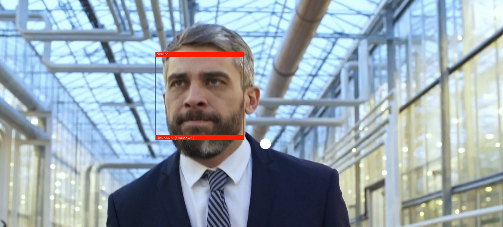

# Facial Emotion Recognition for Children with ASD

### Purpose of Application:

* Help autistic children express themselves
* Understand emotions of children

### Machine Learning Algorithms Used

1. Deep Learning
2. Convolutional Neural Network

### Example of Face and Emotion Detection



### One layer of The CNN
```python
#1st CNN layer
model.add(Conv2D(64, (3,3), padding="same", input_shape=(48,48,1)))
model.add(BatchNormalization())
model.add(Activation('relu'))
model.add(MaxPooling2D(pool_size=(2,2)))
model.add(Dropout(0.25))
```
